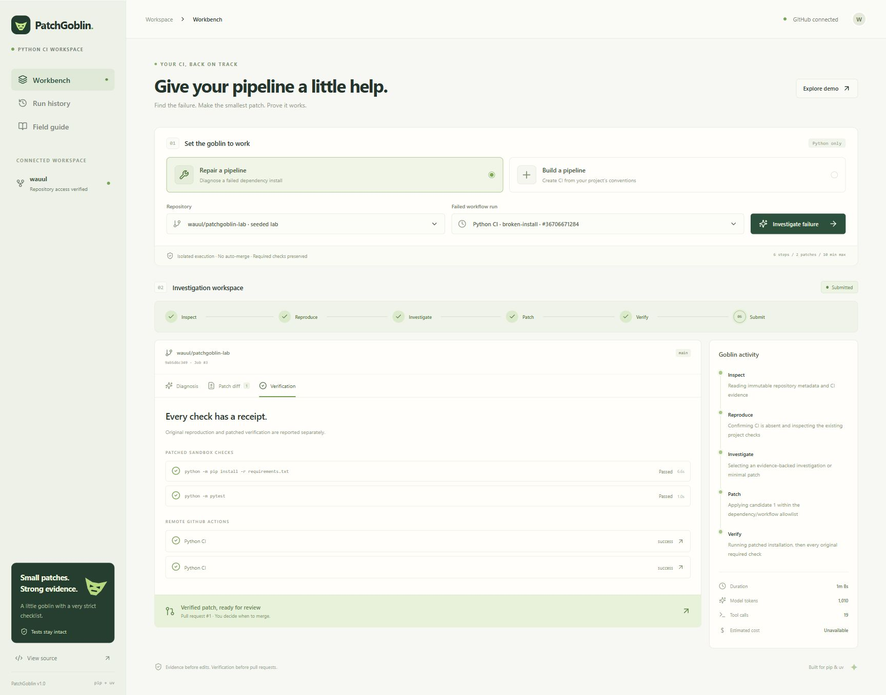
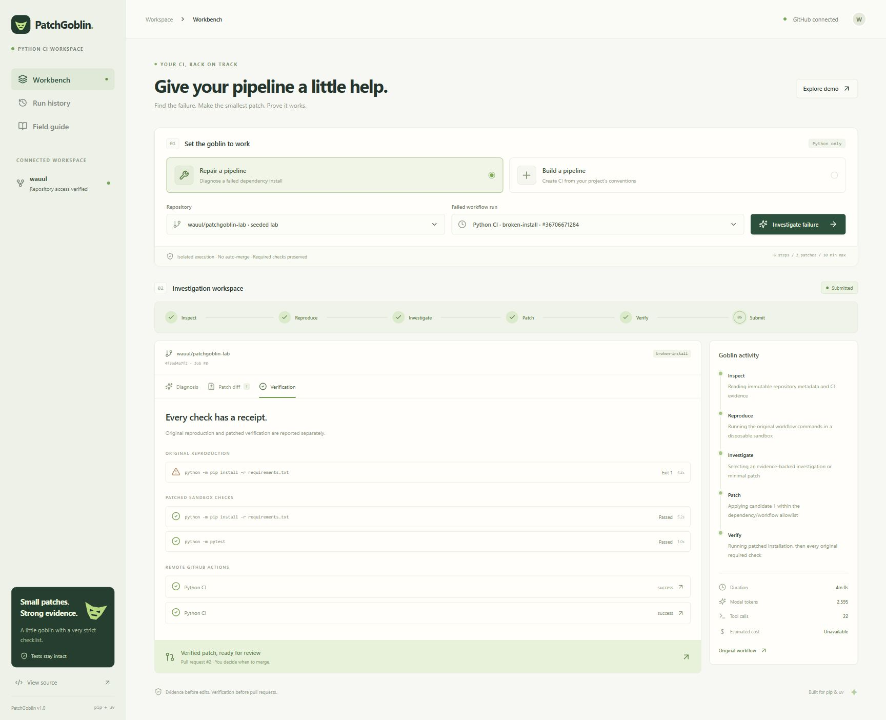

# PatchGoblin

A bounded AI agent that repairs Python dependency failures and builds missing GitHub Actions pipelines. The React workbench shows evidence, diffs, original reproduction, patched verification, PR links, durable history, and measured model usage.

**Repository:** https://github.com/wauul/PatchGoblin

**Live app:** https://patchgoblin.wauul.chatgpt.site (owner-private ChatGPT sign-in).

**Verified builder:** https://github.com/wauul/patchgoblin-lab/pull/1 — six unchanged tests passed in Docker; both push and pull-request GitHub Actions runs passed.

**Verified repair:** https://github.com/wauul/patchgoblin-lab/pull/2 — reproduced the real resolver conflict, relaxed only the incompatible urllib3 declaration, and passed six unchanged tests. Both [push CI](https://github.com/wauul/patchgoblin-lab/actions/runs/36714078825) and [pull-request CI](https://github.com/wauul/patchgoblin-lab/actions/runs/36714084921) passed. One real 7B inference call used 2,595 tokens; agent execution took 239.72 seconds. Neither PR was merged.





Screenshot: local frontend connected to the deployed API through a loopback owner-service proxy. Credentials remain server-side. Normal hosted browser sign-in failed in the available in-app browser with an upstream HTML/JSON parsing error. The existing owner service credential was used to independently verify deployed API functionality, real agent execution, PR submission, and target CI.

**Seeded lab:** https://github.com/wauul/patchgoblin-lab (`main`: missing CI; `broken-install`: intentional dependency conflict). Seeded jobs execute real model calls, Docker commands, and GitHub workflows. The separate illustrative demo executes nothing and consumes no model credits.

## Scope

Pip/uv Python repositories, simple single-job GitHub Actions workflows, Python 3.11–3.13. Supported investigation categories: missing declared dependencies, incompatible constraints, Python version mismatch, installation command errors, and uv lock drift with deterministic `uv lock` refresh. Required tests/checks and project runtime configuration cannot be weakened.

The free deployed integration is scoped to allowlisted **public** repositories owned by the configured GitHub account. Initially it has access only to PatchGoblin and the seeded lab. Unsupported: application bugs/assertions, networking outages, secrets, private archives, Poetry/Pipenv, service or matrix jobs, conditional/custom shell steps, unknown third-party Actions, and non-Python providers. Unsupported results are reported without a success claim or PR.

## Architecture


State: `inspect → reproduce → investigate → patch → verify → submit`. The model selects investigation reads and patches. Deterministic code owns archive handling, command/path/patch policy, sandbox execution, persistence, cancellation, and submission. A verified patch becomes a PR when the authenticated workbench synchronizes the result; long-running work never happens in an HTTP handler. Submission is idempotent by job branch and checks that the base commit has not changed.

GitHub issues/comments are the durable storage layer. They survive frontend refreshes and runner restarts. A terminal job is never re-executed. An interrupted job that reached expensive execution stops safely instead of resetting its budget; the owner must explicitly start a new investigation. The last 30 jobs are listed from the latest 100 control-repository issues.

Model-authored patches are limited to four files and 24 KB. The model can request the narrow `refresh_lock` tool, which runs uv rather than generating a lockfile. Canonical uv locks are bounded at 128 KB. Durable results above GitHub's comment budget use gzip/base64 with SHA-256 and size verification; decoded state is capped at 250 KB and accepted only from trusted authors. Compression provides storage compatibility, not confidentiality; this integration supports public repositories only.

## Local setup

Prerequisites: Node 22+, Python 3.11+, uv 0.8.22+, and Git. Live web jobs use the hosted Actions worker. A working Docker engine is needed only for local agent execution and evaluation; the interface and unit tests do not require it.

```sh
npm ci
uv sync --frozen --group dev
cp .env.example .env
# Set a repository-scoped GITHUB_TOKEN in the ignored .env.
node --import tsx scripts/local-server.ts
# Separate terminal:
npm run dev -- --port 5174
```

Open the URL Vite prints. The local API binds to 127.0.0.1:8787 and supplies a local-only owner identity; hosted APIs require the authenticated identity forwarded by Sites. Never expose the local server to a network or add LOCAL_USER to production environment variables.

```sh
npm test
npm run build
uv run pytest -q
uv run ruff check worker tests
```

Both npm and uv lockfiles are committed. `npm run build` embeds the static React assets into `dist/server/index.js`, exporting the Cloudflare Worker `fetch` handler. The Worker is stateless; durable data is on GitHub.

## GitHub permissions and credentials

Use a fine-grained token selecting only the control and approved target repositories: Actions **read**, Contents **read/write**, Issues **read/write**, Pull requests **read/write**, Workflows **read/write**, Metadata **read**. This token is held only in the ignored local .env and the hosted runtime secret store. It never reaches browser assets, repository code, sandbox containers, or log/model evidence. PatchGoblin does not change repository secrets, branch protection, or merge PRs.

The worker uses the short-lived Actions `GITHUB_TOKEN` with contents:read, actions:read, and issues:write. The control plane retrieves and redacts target CI logs before persisting a job because the worker token cannot read another repository's Actions log endpoint. The worker cannot write target contents. The authenticated control plane submits only a verified, allowlisted patch. Issue-triggered workers check the creator login and request fields; arbitrary users' issues do not execute code. Host credentials are omitted from checkout persistence and all Docker mounts.

Private hosting uses ChatGPT sign-in and owner-only access. Default APIs scope jobs by a hash of the authenticated Site user and reject unauthenticated and cross-origin writes. This confirmed owner-private Site uses PRIVATE_OWNER_MODE=true because Sites authenticates requests at dispatch, including owner service credentials; its jobs share the private owner key. Never enable that adapter for a public/shared Site. Repository names and run IDs are validated, with a repository allowlist and eight jobs/hour cap. GitHub Actions enforces one worker at a time. Public multi-tenant operation and GitHub App installation are future work.

## Sandbox

Repositories are fetched at immutable commit SHAs (20 MB archive / 100 MB extracted / 5,000 files maximum). Symlinks and credential paths are excluded. Code is copied into a disposable directory, mounted at /workspace. Containers run as the unprivileged Linux runner UID (65534 on root/Windows hosts) with all capabilities dropped, no-new-privileges, read-only rootfs, 512 MB RAM, one CPU, 128 PIDs, a 128 MB temporary filesystem, no Docker socket, and no credential mounts or environment variables.

Dependency installation uses an internal-only Docker network with a Squid proxy permitting HTTPS only to pypi.org and files.pythonhosted.org. Tests/checks run with networking disabled. Runtime images and uv are prepared by trusted host code before repository execution. A Docker/proxy failure stops the job; there is no fallback to executing repository code on the host. Sandbox checks are reported separately from remote GitHub Actions results.

## Evaluation

Twelve author-defined fixtures in `fixtures/specs.json` cover five repair categories, pip/uv builders, a no-tests builder, assertions, Poetry, custom commands, and service workflows. Their expected outcomes and acceptance criteria are independent of the model. `worker/evaluate.py` uses the production agent, real model API, real Docker, and unchanged semantic tests. Unit-test doubles are clearly labeled and never used by production or evaluation.

```sh
# Start an authenticated OpenAI-compatible loopback model server, then export
# MODEL_BASE_URL, MODEL_NAME, MODEL_API_KEY. Do not use GitHub tokens for inference.
uv run python -m worker.evaluate --baseline
# One case:
uv run python -m worker.evaluate --case pip-conflict --baseline
```

Alternatively run **PatchGoblin evaluation** in GitHub Actions. It starts the pinned real model automatically with scripts/setup_runner_model.py and a masked ephemeral key. The setup script targets Ubuntu x64; local Windows evaluation requires a working Docker engine and a separately configured compatible model server. Artifacts include per-case evidence and aggregate JSON results. The deterministic baseline creates standard CI, fixes a missing -r, or adds the observed missing requests dependency, and runs the same sandbox checks. Results include reproduction, verified repairs, incorrect repair indicators, unsupported handling, builder acceptance, runtime, tool calls, tokens, and baseline runtime. Fixture execution is sandbox validation on a hosted runner, not successful remote target CI.

Current local checks: **38 Python tests and 12 backend tests passed**, plus TypeScript checking and the production build. PatchGoblin's own GitHub CI is green. Deployed API evidence is in [docs/deployed-verification.json](docs/deployed-verification.json): idempotency, persisted history, repository allowlist, cross-origin rejection, and anonymous 401. Cancellation and successful result retrieval were verified through the browser after refresh. The mobile workbench was checked at 390px with no horizontal overflow; see [mobile screenshot](docs/workbench-mobile.jpg).

The complete real-inference [12-case run](https://github.com/wauul/PatchGoblin/actions/runs/36715987219) passed **11/12 independent acceptance checks: 5/5 repairs, 2/3 builders, and 4/4 unsupported cases**, with **0/5 incorrect verified repairs**. The simple baseline passed 2/5 repairs, 3/3 builders, and 3/4 unsupported classifications. Agent totals: 11,715 measured tokens, 94 tool calls, 640.92 summed seconds; baseline 48.79 seconds and no model tokens. The model incorrectly rejected a valid uv builder. After a narrow instruction correction, its [targeted retest](https://github.com/wauul/PatchGoblin/actions/runs/36717541679) passed with 1,735 tokens, 9 tool calls, and 129.66 seconds. The original failure is retained; this is not a new complete 12/12 run. The retest's model explanation was contradictory even though its patch and actual checks were valid. Treat model narrative as a hypothesis and command evidence as verification. See [full results, per-case evidence, and development failures](docs/evaluation.md) and [aggregate JSON](docs/evaluation-results.json). Workflow completion alone is never counted as agent success.

## Deployment

1. Create a public GitHub control repository and copy `.github/workflows/agent.yml`, CI, and the Python worker. Adjust the owner and repository allowlist consistently in the workflow and runtime environment.
2. Store the fine-grained GitHub token as the hosted **GITHUB_TOKEN secret**. Set CONTROL_REPO, ALLOWED_REPOS, OWNER_LOGIN as nonsecret runtime variables. Set PRIVATE_OWNER_MODE=true only after confirming sole-owner private Sites access; otherwise require the authenticated identity header. Do not put tokens in .openai/hosting.json.
3. Run the tests and `npm run build`. Commit and push the exact source, including .openai/hosting.json with the provisioned Site ID.
4. Package .openai/hosting.json and dist/server/index.js as a tar.gz. Save an archive-backed Sites version using the pushed commit SHA and deploy that version privately. A successful deployment status confirms the URL; test the complete authenticated flow in the browser.
5. Start a builder or repair job in the deployed UI. GitHub issues enqueue it, the Actions worker persists progress, the UI synchronizes verification and submits its PR. Confirm target CI independently.

The bundled Sites helper scripts were unavailable in this development environment, so the source push and archive packaging use the same native Sites API contract directly. The repository contains the build and push scripts for reproducibility.

## Costs and limits

No paid resource or subscription is provisioned. Real inference runs Qwen2.5-Coder-7B-Instruct Q4_K_M through llama.cpp on the disposable public runner CPU, bound to loopback with a masked ephemeral API key. Downloads are revision-pinned and SHA-256 verified; the approximately 4.7 GB model is cached. The model is [Apache-2.0 licensed](https://huggingface.co/Qwen/Qwen2.5-Coder-7B-Instruct-GGUF/tree/main). A smaller 3B model was evaluated first and escalated after repeated failed constraint repairs; its failures remain part of the recorded development evidence. GitHub Models retired July 30, 2026 ([official notice](https://docs.github.com/en/github-models)); no integration depends on it. There is no invented dollar estimate. Six investigation steps, two patch attempts, 12,000 total input/output model tokens, and ten minutes of agent execution per job, within a 15-minute runner limit including inference startup. Local llama.cpp prompt tokens are counted before generation; other compatible endpoints use a conservative byte bound. If provider usage is absent, the remaining budget is conservatively consumed and further calls stop. Each command has a 120-second and output-size limit. Public runners reuse trusted base images within an evaluation run; repository environments are always recreated.

## Troubleshooting

- **GitHub unavailable:** confirm token expiry and selected repository permissions; replace only the runtime secret, then redeploy.
- **Queued:** inspect the control repo's Actions worker and the job issue. A concurrency slot may be occupied or inference may be starting. Cancellation closes the issue; the worker checks it every five seconds during sandbox execution and between model requests. An in-flight model HTTP call is bounded by the remaining agent deadline, up to 480 seconds.
- **No failed runs:** ensure the target has an actual failed GitHub Actions run and the token has Actions:read.
- **Docker/proxy unavailable:** enable a Docker engine locally or use the hosted Actions worker. Code is not executed unsandboxed.
- **Unsupported workflow:** check the bounded single-job command scope. Required/custom checks are never silently dropped.
- **No PR:** only verified jobs submit; keep/open the workbench to synchronize. A changed base SHA or expired token stops submission safely.
- **No test coverage:** an install-only workflow may be verified when the repository has no tests; the result says so explicitly.
- **Model unavailable:** inspect the inference setup step and local runner runtime log. The small CPU model can produce invalid or unhelpful candidates; policy rejection and measured failures remain visible. Paid subscriptions/credits require approval.
- **Hosted sign-in:** retry ChatGPT sign-in in your normal browser. The available in-app browser returned an upstream HTML/JSON parsing error; owner-only hosting remains enforced.
- **Token expiry:** the project-scoped runtime token expires October 30, 2026. Rotate it through supported secret storage; the application never changes repository secrets.
