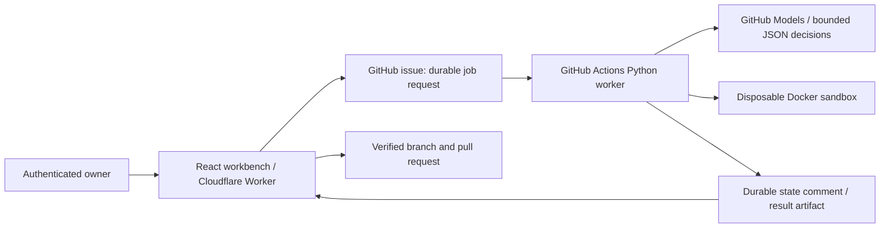

# PatchGoblin

A bounded AI agent that repairs Python dependency failures and builds missing GitHub Actions pipelines. The React workbench shows evidence, diffs, original reproduction, patched verification, PR links, durable history, and measured model usage.

**Repository:** https://github.com/wauul/PatchGoblin

**Hosting:** private Sites deployment is being verified. The deployment URL and real evaluation results are updated after verification.

**Seeded lab:** https://github.com/wauul/patchgoblin-lab (`main`: missing CI; `broken-install`: intentional dependency conflict). Seeded jobs execute real model calls, Docker commands, and GitHub workflows. The separate illustrative demo executes nothing and consumes no model credits.

## Scope

Pip/uv Python repositories, simple single-job GitHub Actions workflows, Python 3.11–3.13. Supported investigation categories: missing declared dependencies, incompatible constraints, Python version mismatch, installation command errors, and uv lock drift with deterministic `uv lock` refresh. Required tests/checks and project runtime configuration cannot be weakened.

The free deployed integration is scoped to allowlisted **public** repositories owned by the configured GitHub account. Initially it has access only to PatchGoblin and the seeded lab. Unsupported: application bugs/assertions, networking outages, secrets, private archives, Poetry/Pipenv, service or matrix jobs, conditional/custom shell steps, unknown third-party Actions, and non-Python providers. Unsupported results are reported without a success claim or PR.

## Architecture



State: `inspect → reproduce → investigate → patch → verify → submit`. The model selects investigation reads and patches. Deterministic code owns archive handling, command/path/patch policy, sandbox execution, persistence, cancellation, and submission. A verified patch becomes a PR when the authenticated workbench synchronizes the result; long-running work never happens in an HTTP handler. Submission is idempotent by job branch and checks that the base commit has not changed.

GitHub issues/comments are the durable storage layer. They survive frontend refreshes and runner restarts. A terminal job is never re-executed. An interrupted job that reached expensive execution stops safely instead of resetting its budget; the owner must explicitly start a new investigation. The last 30 jobs are listed from the latest 100 control-repository issues.

## Local setup

Prerequisites: Node 22+, Python 3.11+, uv 0.8.22+, Git, and a working Docker engine for real agent execution. The web interface and unit tests do not require Docker.

```sh
npm ci
uv sync --frozen --group dev
cp .env.example .env
# Set a repository-scoped GITHUB_TOKEN in the ignored .env.
node --import tsx scripts/local-server.ts
# Separate terminal:
npm run dev -- --port 5174
```

Open the URL Vite prints. The local API binds to 127.0.0.1:8787 and supplies a local-only owner identity; hosted APIs require the authenticated identity forwarded by Sites. Never expose the local server to a network or add LOCAL_USER to production environment variables.

```sh
npm test
npm run build
uv run pytest -q
uv run ruff check worker tests
```

Both npm and uv lockfiles are committed. `npm run build` embeds the static React assets into `dist/server/index.js`, exporting the Cloudflare Worker `fetch` handler. The Worker is stateless; durable data is on GitHub.

## GitHub permissions and credentials

Use a fine-grained token selecting only the control and approved target repositories: Actions **read**, Contents **read/write**, Issues **read/write**, Pull requests **read/write**, Workflows **read/write**, Metadata **read**. This token is held only in the ignored local .env and the hosted runtime secret store. It never reaches browser assets, repository code, sandbox containers, or log/model evidence. PatchGoblin does not change repository secrets, branch protection, or merge PRs.

The worker uses the short-lived Actions `GITHUB_TOKEN` with contents:read, actions:read, issues:write, and models:read. It cannot write target repository contents. The authenticated control plane submits only a verified, allowlisted patch. Issue-triggered workers check the creator login and request fields; arbitrary users' issues do not execute code. Host credentials are omitted from Actions checkout persistence and all Docker mounts.

Private hosting uses ChatGPT sign-in and owner-only access. The server scopes jobs by a hash of the authenticated Site user and rejects unauthenticated and cross-origin writes. Repository names and run IDs are validated, with a repository allowlist and eight jobs/hour cap. GitHub Actions enforces one worker at a time. Public multi-tenant operation and GitHub App installation are future work; do not make this owner-token deployment public.

## Sandbox

Repositories are fetched at immutable commit SHAs (20 MB archive / 100 MB extracted / 5,000 files maximum). Symlinks and credential paths are excluded. Code is copied into a disposable directory, mounted at /workspace. Containers run as UID 65534 with all capabilities dropped, no-new-privileges, read-only rootfs, 512 MB RAM, one CPU, 128 PIDs, a 128 MB temporary filesystem, no Docker socket, and no credential mounts or environment variables.

Dependency installation uses an internal-only Docker network with a Squid proxy permitting HTTPS only to pypi.org and files.pythonhosted.org. Tests/checks run with networking disabled. Runtime images and uv are prepared by trusted host code before repository execution. A Docker/proxy failure stops the job; there is no fallback to executing repository code on the host. Sandbox checks are reported separately from remote GitHub Actions results.

## Evaluation

Twelve author-defined fixtures in `fixtures/specs.json` cover five repair categories, pip/uv builders, a no-tests builder, assertions, Poetry, custom commands, and service workflows. Their expected outcomes and acceptance criteria are independent of the model. `worker/evaluate.py` uses the production agent, real model API, real Docker, and unchanged semantic tests. Unit-test doubles are clearly labeled and never used by production or evaluation.

```sh
# Export a model token with appropriate inference permission, or MODEL_API_KEY.
uv run python -m worker.evaluate --baseline
# One case:
uv run python -m worker.evaluate --case pip-conflict --baseline
```

Alternatively run **PatchGoblin evaluation** in GitHub Actions. It supplies a models:read workflow token. Artifacts include per-case evidence and a aggregate JSON result. The deterministic baseline creates standard CI, fixes a missing -r, or adds the observed missing requests dependency, and runs the same sandbox checks. Results include reproduction, verified repairs, incorrect repair indicators, unsupported handling, builder acceptance, runtime, tool calls, tokens, and baseline runtime. Fixture execution is local sandbox validation on a hosted runner, not successful remote target CI.

Actual unit checks so far: **24 Python tests and 9 backend tests passed**. Real model/sandbox evaluation and deployed flow verification are in progress; no repair success rate is claimed yet.

## Deployment

1. Create a public GitHub control repository and copy `.github/workflows/agent.yml`, CI, and the Python worker. Adjust the owner and repository allowlist consistently in the workflow and runtime environment.
2. Store the fine-grained GitHub token as the hosted **GITHUB_TOKEN secret**. Set CONTROL_REPO, ALLOWED_REPOS, OWNER_LOGIN as nonsecret runtime variables. Preserve owner-only Site access. Do not put tokens in .openai/hosting.json.
3. Run the tests and `npm run build`. Commit and push the exact source, including .openai/hosting.json with the provisioned Site ID.
4. Package .openai/hosting.json and dist/server/index.js as a tar.gz. Save an archive-backed Sites version using the pushed commit SHA and deploy that version privately. A successful deployment status confirms the URL; test the complete authenticated flow in the browser.
5. Start a builder or repair job in the deployed UI. GitHub issues enqueue it, the Actions worker persists progress, the UI synchronizes verification and submits its PR. Confirm target CI independently.

The bundled Sites helper scripts were unavailable in this development environment, so the source push and archive packaging use the same native Sites API contract directly. The repository contains the build and push scripts for reproducibility.

## Costs and limits

No paid resource or subscription is provisioned. Public GitHub repositories use standard GitHub-hosted Actions; inference uses GitHub Models with its free-tier quota. PatchGoblin does not enable paid inference. Token/usage availability and provider 403/429 failures are handled explicitly; there is no invented dollar estimate. Six investigation steps, two patch attempts, 12,000 reported model tokens, and ten minutes per job. If provider usage is absent, the remaining budget is conservatively consumed and further calls stop. Each command has a 120-second and output-size limit. Public runners cache trusted base images per evaluation run; repository environments are always recreated to prevent false repair successes.

## Troubleshooting

- **GitHub unavailable:** confirm token expiry and selected repository permissions; replace only the runtime secret, then redeploy.
- **Queued:** inspect the control repo's Actions worker and the job issue. A concurrency slot may be occupied; cancellation closes the issue and is checked by the worker every five seconds.
- **No failed runs:** ensure the target has an actual failed GitHub Actions run and the token has Actions:read.
- **Docker/proxy unavailable:** enable a Docker engine locally or use the hosted Actions worker. Code is not executed unsandboxed.
- **Unsupported workflow:** check the bounded single-job command scope. Required/custom checks are never silently dropped.
- **No PR:** only verified jobs submit; keep/open the workbench to synchronize. A changed base SHA or expired token stops submission safely.
- **No test coverage:** an install-only workflow may be verified when the repository has no tests; the result says so explicitly.
- **Model quota:** wait for free-tier limits to reset or configure an already-authorized provider. Paid subscriptions/credits require approval.
