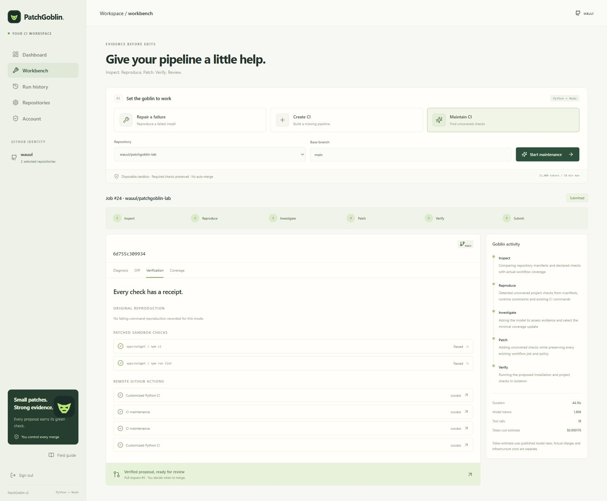

# PatchGoblin public product verification

Verified September 30, 2026 against the actual Vercel, Groq, Neon and Railway deployment. This report distinguishes hosted agent work, backend fixtures, browser harnesses and unverified boundaries. Public source/labs are deliberately disposable examples, not customer repositories.

## Entry points and infrastructure

- Web: https://patchgoblin.vercel.app — public canonical origin; private routes require a GitHub session.
- GitHub App: https://github.com/apps/patchgoblin-ci/installations/new — App 5136754; selected repository installation.
- Extension package: https://patchgoblin.vercel.app/patchgoblin-extension.zip — source/build/install instructions in [extension README](../extension/README.md); not store listed.
- Worker: https://worker-production-ac16.up.railway.app — authenticated wake, isolated Railway/Docker execution.
- Source: https://github.com/wauul/PatchGoblin

Dedicated OAuth App 3894466 was created under GitHub developer settings. Hosted sign-out cleared the session; subsequent consent requested public identity only and returned the authenticated dashboard. Separate repository-App authorization then refreshed the selected installation. Identity OAuth tokens are discarded. [Registration evidence](github-oauth.md), [consent screenshot](github-oauth-consent.png), [dashboard screenshot](oauth-dashboard.png).

## Actual hosted trials

[Full public-lab evidence](product-results.json) contains command logs, diffs, coverage, measured usage and remote run URLs. All ten trials are retained; the four submissions represent three distinct PRs because maintenance updated its original PR.

| Job | Mode/result | Measured tokens | Agent seconds | Outcome |
| --- | --- | ---: | ---: | --- |
| 14 | Node builder, failed | Unavailable | 0.13 | Repository-route boundary bug stopped execution before model; fixed and retained |
| 15 | Node builder, submitted | 1,379 | 70.00 | [Product lab PR 1](https://github.com/wauul/patchgoblin-product-lab/pull/1); npm install/test/lint/build passed; both remote events passed |
| 16 | Automatic maintenance, failed | 1,231 | 2.51 | Model regenerated a byte-different proposal; strict policy rejected it. Candidate selection now uses immutable checksum |
| 18 | Automatic maintenance, unsupported | 1,271 | 2.76 | Model confused proposed coverage with current coverage. Explicit before/proposed evidence corrected the prompt; original rejection retained |
| 19 | Automatic npm repair, failed | 0 | 45.27 | Real lock mismatch reproduced; byte-bound prompt estimate stopped before inference. GPT-OSS tokenizer budgeting corrected this |
| 20 | Automatic maintenance, submitted | 1,268 | 60.41 | [Lab PR 5](https://github.com/wauul/patchgoblin-lab/pull/5) adds TypeScript package test/type-check/build; four remote runs passed |
| 21 | Automatic Python repair, verified only | 3,711 | 65.57 | Pip conflict repaired and six tests passed. Fixture branch changed during verification, so stale-head guard prevented submission |
| 22 | Automatic Python repair, failed | Unavailable | 73.40 | Railway sandbox operation failed; no inference/PR success claimed; VM ID cleared |
| 23 | Automatic npm repair, submitted | 4,053 | 73.92 | [Lab PR 6](https://github.com/wauul/patchgoblin-lab/pull/6); lock mismatch reproduced, canonical lock repaired, unchanged Node checks passed; four remote Node/Python runs passed |
| 24 | Manual maintenance update, submitted | 1,808 | 44.16 | New lint declaration appended verified coverage to **the same PR 5**; four remote runs passed |

Aggregate: four submitted, one verified without submission, one unsupported, four failed; 14,721 recorded provider tokens. Unavailable usage is not treated as measured zero. Job 17 was a rollback-only database fixture allocation, not a hosted agent trial. IDs are not a success score.

The last automatic lint push hit the account hourly quota; it created no job. After the rolling limit allowed work, job 24 was explicitly started through the authenticated web UI. No quota was reset or bypassed. Branch creation and fixture commit generated two real Python failures, explaining jobs 21/22; the first source became stale. Neither was erased or counted as a submitted repair.

The four remote runs for each mixed-language PR represent push and pull-request events for both workflows. Original handwritten Python CI is byte-identical at main and both PR heads. PR 6 changes only package-lock.json; PR 5 changes only the managed workflow. Its prior job is retained when lint is appended. [Preservation and control receipts](product-controls-verification.json). No PR was merged. Every execution VM and lease was cleared.

## Acceptance checks

| Requirement | Evidence and boundary |
| --- | --- |
| GitHub OAuth login/logout | Real hosted consent, identity dashboard, sign-out, subsequent OAuth login; separate App grant verified |
| Selected installation | Initial installation 166562115 selected exactly the two public labs; uninstall verified; restored installation 166595522 narrowed back to those labs |
| Authorized/denied access | Installed writable lab actions work. Nonselected source repository returns installed=false in the popup; anonymous/client-owner-header requests return 401 |
| Automatic repair | Real failure event created job 23 and PR 6; installation-scoped submission and remote CI passed |
| Missing CI creation | Job 15 inspected a repository with no default-branch workflow, ran original checks and opened PR 1; two remote runs passed |
| New package/check maintenance | Real push created job 20; new TypeScript package coverage verified. Job 24 added lint to the existing PR |
| Searchable history | Hosted history search for the product lab plus submitted-status filter returns actual builder job 15 |
| Preserve customization | Byte-identical original Python workflow in both PR heads; original tests retained; all remote workflows passed |
| Duplicate delivery | Same signed production ping posted twice: first duplicate=false, second duplicate=true; exactly one Neon row |
| Self-trigger prevention | App PR/push/workflow events produce remote receipts, no recursive agent jobs; dedicated delivery-policy tests also cover these cases |
| Extension | Real popup/browser harness tested repository recognition, installed/unauthorized/unavailable status, Open and Repair destinations and disabled inappropriate actions. Native tab APIs are simulated, never represented as native Chrome verification |
| Pause/disable | Hosted administrator settings persist; unavailable repositories reject work without creating a job. Settings restored to enabled/manual with automation off |
| Uninstall | Real App installation removed; GitHub lookup returned absent, both repositories inactive, memberships removed and automation off. Restored with exactly two selected labs |
| Account export/deletion | Real production HTTP routes tested using a short-lived, clearly labeled backend-session fixture. Export excludes credentials; origin denial and deletion checked; all fixture account/session/evidence rows removed. The real operator account was preserved |

[Live HTTP receipts](product-http-verification.json). [Rollback-only Neon acceptance script](../scripts/verify-product-db.py) passed seven checks: idempotency, ownership, account concurrency, repository quota, evidence/session deletion, worker deletion-race protection, and preservation of another account. Those database fixtures never committed and never claimed OAuth or model success.

## Implementation verification and boundaries

Final local checks passed: 71 Python tests, 28 Node tests, ruff, TypeScript and the production build. Tests use explicit provider/database fixtures; they are not production runs. Historical [12-case Qwen evaluation](evaluation.md) remains 11/12 with a targeted uv-builder retest; these hosted Groq trials are not a replacement independent benchmark or a claimed 12/12 score.

The mobile navigation overflow found during 375px inspection was fixed by wrapping the five workspace destinations into a bounded grid. Final browser inspection measured both viewport and document width at 375px after the authenticated workbench loaded; screenshot: [mobile workbench](product-mobile.png). The extension ZIP is byte-identical across UTC, Europe/Paris and America/Los_Angeles build timezones and matches the deployed download.

Organization installation and private archives are implemented with live permission checks but were not tested on an organization/private repository. Native Chrome unpacked loading was confirmed by the user; native permission/cookie behavior cannot be automated with the available browser. A temporary explicitly labeled harness used the actual popup/backend and simulated only tab APIs; it is removed from the final public deployment. Positive Create-CI URL construction is unit-tested; the live harness's current repositories already have CI, so that action is correctly disabled.

The accessible Microsoft Partner Center account is not enrolled in the Edge extension program. Registration requires an immutable legal country/account setup and verification; missing publisher/contact details were not invented. Edge registration is free; Chrome can require a registration fee. No store payment/enrollment or publication was performed. The installable package and truthful publication instructions are supplied.

Railway uses existing Hobby credits; Vercel/Neon/Groq free tiers were used, no new purchase/subscription. Displayed token costs are estimates, not provider billing receipts. The old runtime PAT was removed from Vercel/Railway; source publication still uses the separate ignored development credential. A dedicated operator legal contact remains configurable and visibly unconfigured.
